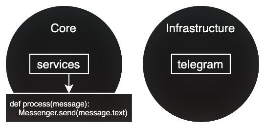

# FastAPI Telegram Onion Echobot
FastAPI simple telegram bot with onion architecture that responds with the same text - echobot.



### Usage
```sh
mv .env.dist .env
pip install -r requirements.txt
python main.py
```

#### Docker
```sh
docker compose up
```

#### For Education purposes only.
Telegram may send repeated updates.
You can use Redis/memcached for production.
